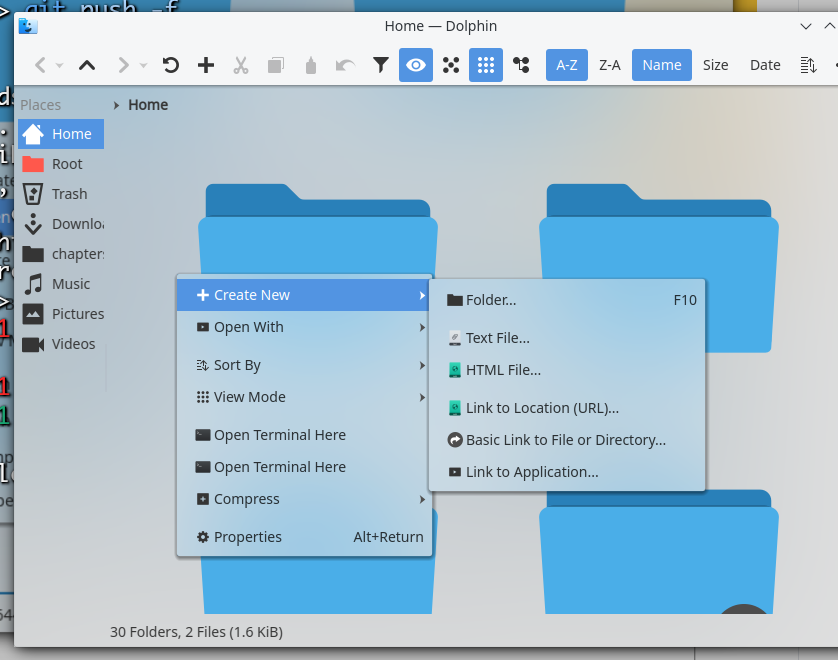

This kvantum theme is created for dolphin. It is based on KvArc, patched with transparent background, the shadow of Lenny's toolbar and rounded corners of KvRoughGlass's menu.



# INSTALLATION

```sh
cd ~/.config/Kvantum
git clone https://github.com/rbn42/KvArcDolphin
cd KvArcDolphin
#Generate the theme
bash ./generate.sh
#Apply the theme to dolphin
echo KvArcDolphin=dolphin >> ../kvantum.kvconfig
```
